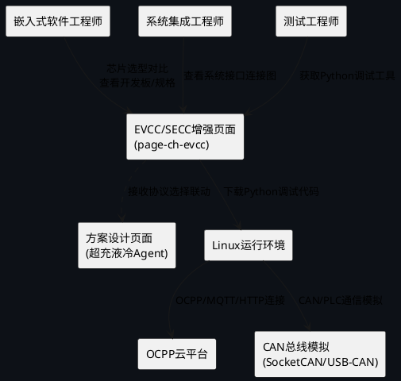
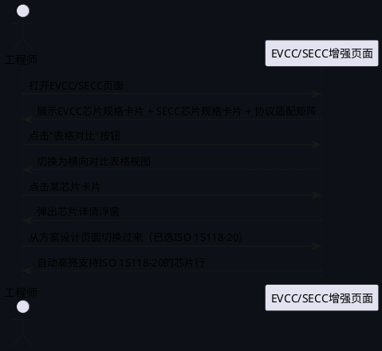
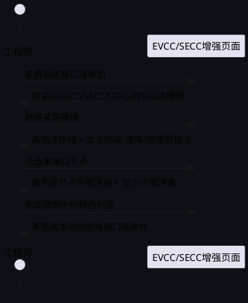
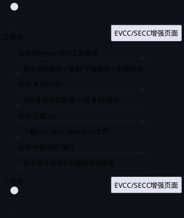
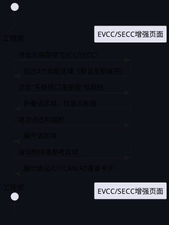

# 充电方案智能体→EVCC/SECC页面重大增强 — 需求规格

# **1. 组件定位**

## **1.1 核心职责**

本组件负责提供EVCC/SECC的工程级选型、系统接口连接可视化、以及基于Python的ISO15118通信调试工具，替代现有简化的芯片选型表格页面。

## **1.2 核心输入**

1. **用户芯片选型查询**：用户点击EVCC/SECC芯片行查看详细规格参数的请求
2. **用户接口连接图浏览**：用户查看EVCC/SECC与车辆/充电桩/云平台连接关系的请求
3. **用户调试参数配置**：用户设置Python调试工具运行参数（云平台URL、协议版本、模拟角色等）
4. **用户代码下载请求**：用户复制或下载Python调试工具源代码的请求
5. **用户协议选择联动**：从方案设计页面传入的充电协议选择结果

## **1.3 核心输出**

1. **芯片详细规格卡片**：每款EVCC/SECC芯片的具体型号、封装、引脚数、开发板型号、主频、Flash、RAM、外设接口等完整参数
2. **系统接口连接SVG图**：EVCC/SECC与BMS/CAN/PLC、功率模块、OCPP/MQTT/HTTP云平台的完整连接关系图，标注协议、速率、物理层
3. **Python调试工具代码**：可运行于Linux的Python程序，支持EVCC模拟、SECC模拟、云平台连接、ISO15118协议栈调试
4. **代码下载/复制功能**：提供一键复制和文件下载两种方式获取Python代码

## **1.4 职责边界**

- 本组件**不负责**实际硬件采购和供应链管理（仅提供选型参考和开发板型号）
- 本组件**不负责**Python程序的远程执行（代码由用户下载后在本地Linux环境运行）
- 本组件**不负责**ISO15118协议栈的完整协议实现（Python调试工具为模拟/调试级别，非生产级协议栈）
- 本组件**不负责**替代超充液冷页面中的EVCC/SECC标签页（两者为不同入口，本页面为独立增强版）
- 本组件**不负责**OCPP协议栈的详细实现（OCPP连接为调试工具的一个功能模块，非独立OCPP页面）

# **2. 领域术语**

**EVCC**
: 电动汽车通信控制器（Electric Vehicle Communication Controller），车载端芯片/模块，负责与充电桩SECC之间的协议通信，支持ISO15118/GB/T 27930等标准。

**SECC**
: 供电设备通信控制器（Supply Equipment Communication Controller），充电桩端芯片/模块，负责与车辆EVCC之间的协议通信和充电控制。

**ISO 15118**
: 道路车辆-车辆到电网通信接口国际标准。-2为基于PLC（Power Line Communication）的版本，支持即插即充（PnC）；-20为基于IP的下一代版本，支持PnC+V2G（车辆到电网）。

**GB/T 27930**
: 中国电动汽车非车载传导式充电机与BMS通信协议国家标准，基于CAN总线通信。

**DIN 70121**
: 德国电动汽车与充电桩通信标准，ISO 15118的前身，基于PLC通信。

**PLC/SLAC**
: 电力线载波通信（Power Line Communication）/信号层衰减校准（Signal Level Attenuation Characterization），用于CP信号线上叠加的高频数据通信，ISO 15118-2的物理层。

**OCPP**
: 开放充电桩协议（Open Charge Point Protocol），充电桩与云平台之间的标准通信协议，当前主流版本1.6J/2.0.1，支持JSON over WebSocket和SOAP over HTTP。

**BMS**
: 电池管理系统（Battery Management System），车载端负责电池状态监控、充放电控制、SOC/SOH估算。

**CP信号**
: 充电连接确认信号（Control Pilot），PWM调制，12V/9V/6V/3V四态，用于充电状态机控制。

**PnC**
: 即插即充（Plug and Charge），ISO 15118定义的自动认证和计费机制，无需刷卡或扫码。

**V2G**
: 车辆到电网（Vehicle to Grid），电动汽车向电网反向送电的技术，ISO 15118-20支持。

**开发板/EVK**
: 评估套件（Evaluation Kit），芯片厂商提供的开发板，用于原型验证和软件开发。

: 备注：与"量产方案"区分，开发板用于调试阶段，量产方案为实际产品PCBA。

**封装（Package）**
: 芯片的物理封装形式，如LQFP-144、BGA-256等，决定引脚数量和PCB布局。

# **3. 角色与边界**

## **3.1 核心角色**

- **嵌入式软件工程师**：使用本组件进行EVCC/SECC芯片选型对比、查看开发板型号、获取Python调试工具进行通信开发
- **系统集成工程师**：使用本组件查看系统接口连接图、理解EVCC/SECC在充电系统中的位置和接口关系
- **测试工程师**：使用Python调试工具模拟EVCC/SECC进行通信协议测试和调试

## **3.2 外部系统**

- **方案设计页面（超充液冷Agent）**：提供充电协议选择参数，本组件根据协议选择高亮适配芯片
- **Linux运行环境**：Python调试工具的目标运行平台，用户在本地Linux环境执行下载的Python代码
- **OCPP云平台**：Python调试工具的连接目标，通过WebSocket/HTTP上报充电状态
- **CAN总线模拟**：Python调试工具通过SocketCAN或USB-CAN适配器模拟BMS CAN通信

## **3.3 交互上下文**

# **4. DFX约束**

## **4.1 性能**

1. 页面首次渲染时间不得超过2秒
2. SVG系统接口连接图渲染时间不得超过1.5秒
3. Python代码复制操作必须在100ms内完成
4. 标签页/区域切换响应时间不得超过200ms

## **4.2 可靠性**

1. SVG渲染异常时必须显示降级文本描述，不得出现渲染崩溃
2. Python代码嵌入内容必须完整可运行，不得因HTML转义导致代码损坏
3. 芯片规格数据缺失时必须显示"待补充"标记，不得显示空白

## **4.3 安全性**

1. Python代码中不得硬编码云平台API Key或认证凭据
2. Python代码中云平台URL必须通过命令行参数传入，不得硬编码默认值
3. 页面中不得暴露内部供应链定价信息

## **4.4 可维护性**

1. 页面渲染函数必须独立封装，函数命名遵循`chEvcc[SectionName]()`格式
2. SVG图元必须使用符号库引用（`<use href="#symbol-xxx"/>`），禁止内联重复定义
3. Python代码必须作为JavaScript字符串常量嵌入，通过`window.CH_EVCC_PYTHON_CODE`全局变量管理
4. 修改`index.html`后必须同步到`dist/index.html`

## **4.5 兼容性**

1. 必须兼容现有CSS变量体系（`--bg1`/`--bg2`/`--bg3`/`--border`/`--blue`/`--green`/`--purple`等）
2. 必须兼容现有页面导航机制（左侧菜单"充电方案智能体"→EVCC/SECC子菜单）
3. 现有`page-ch-evcc`的DOM id必须保留，页面内容在原容器内重新渲染
4. 全局变量声明必须使用`window.X=window.X||...`模式，避免与内联bundle冲突

# **5. 核心能力**

## **5.1 芯片详细规格展示**

### **5.1.1 业务规则**

1. **EVCC芯片规格展示规则**：必须展示3款EVCC芯片的完整规格参数，每款芯片包含以下字段
   - 芯片系列：NXP S32K3 / TI TMS570 / 瑞萨RH850
   - 具体型号：如S32K344、TMS570LS1227、RH850/P1H-C等
   - 封装：如LQFP-144、BGA-256等
   - 引脚数：如144、256等
   - 开发板型号：如S32K344-EVB、TMDX570LS1227等
   - 主频（MHz）：如160MHz、180MHz、320MHz等
   - Flash（KB）：如2048KB、3072KB、4096KB等
   - RAM（KB）：如512KB、640KB、1024KB等
   - 外设接口：CAN-FD路数、Ethernet路数、SPI/I2C/UART路数
   - 支持协议：ISO 15118-2/20、DIN 70121、GB/T 27930的适配状态
   - 安全特性：HSM、ASIL等级
   - 推荐应用场景

   a. 验收条件：When 用户打开EVCC/SECC页面, the EVCC/SECC增强页面 shall 在EVCC区域展示3款芯片的完整规格卡片，每张卡片包含上述12类字段

2. **SECC芯片规格展示规则**：必须展示3款SECC芯片的完整规格参数，每款芯片包含以下字段
   - 芯片系列：TI C2000 / NXP i.MX6 / STM32H7
   - 具体型号：如TMS320F28379D、i.MX6ULL、STM32H743等
   - 封装、引脚数、开发板型号
   - 主频（MHz）、Flash（KB）、RAM（KB）
   - 外设接口：CAN-FD路数、Ethernet路数、SPI/I2C/UART路数
   - 支持协议适配状态
   - 安全特性
   - 推荐应用场景

   a. 验收条件：When 用户打开EVCC/SECC页面, the EVCC/SECC增强页面 shall 在SECC区域展示3款芯片的完整规格卡片，每张卡片包含上述12类字段

3. **芯片规格对比表格规则**：除卡片展示外，必须提供表格形式的横向对比视图，支持一键切换卡片/表格视图

   a. 验收条件：When 用户点击"表格对比"按钮, the EVCC/SECC增强页面 shall 将EVCC和SECC的芯片规格切换为表格对比视图，每列为一个芯片，每行为一个参数

4. **芯片详情浮窗规则**：点击任意芯片卡片或表格行，必须弹出详情浮窗，展示该芯片的完整规格参数和推荐应用场景描述

   a. 验收条件：When 用户点击NXP S32K344芯片卡片, the EVCC/SECC增强页面 shall 弹出浮窗显示该芯片的12类完整参数和推荐应用场景

5. **协议适配矩阵规则**：必须展示芯片与充电协议的适配矩阵表格，行为芯片型号，列为协议标准，单元格标注支持/部分支持/不支持

   a. 验收条件：When 协议适配矩阵渲染完成, the EVCC/SECC增强页面 shall 显示6款芯片×4种协议的适配矩阵，每个单元格标注支持状态

6. **方案联动高亮规则**：当从方案设计页面传入协议选择时，必须高亮支持该协议的芯片行

   a. 验收条件：When 方案设计选择ISO 15118-20协议后用户切换到本页面, the EVCC/SECC增强页面 shall 高亮支持ISO 15118-20的芯片行（S32K344、STM32H743等）

7. **禁止项**：禁止仅展示芯片系列名称而不给出具体型号，禁止省略封装和引脚信息

   a. 验收条件：When 芯片规格展示完成, the EVCC/SECC增强页面 shall 每款芯片必须显示具体型号、封装、引脚数，不得仅显示系列名

### **5.1.2 交互流程**

### **5.1.3 异常场景**

1. **芯片规格数据缺失**
   a. 触发条件：某款芯片的部分参数数据未录入
   b. 系统行为：显示已有数据，缺失字段显示"—（待补充）"
   c. 用户感知：缺失参数处显示"—（待补充）"标记，不影响其他字段展示

2. **协议适配状态不确定**
   a. 触发条件：某芯片对某协议的支持状态为"部分支持"或"需外挂PHY"
   b. 系统行为：单元格标注"部分支持"并添加备注说明所需外部条件
   c. 用户感知：单元格显示"部分支持（需外挂PLC PHY）"等说明

## **5.2 系统接口连接图**

### **5.2.1 业务规则**

1. **连接图整体布局规则**：必须以EVCC/SECC为中心，展示三大连接域的完整接口关系
   - 左侧域：车辆侧（BMS/CAN/PLC/CP信号）
   - 中央域：EVCC/SECC通信控制器
   - 右侧域：充电桩侧（功率模块/DC输出）和云平台侧（OCPP/MQTT/HTTP）

   a. 验收条件：When 用户查看系统接口连接图, the EVCC/SECC增强页面 shall 渲染以EVCC/SECC为中心的SVG连接图，左侧为车辆域，右侧为桩侧+云平台域

2. **EVCC接口连接规则**：EVCC节点必须展示以下接口连接
   - EVCC → BMS：CAN 2.0B / CAN-FD，500kbps/5Mbps，物理层为高速CAN收发器（如TJA1463）
   - EVCC → SECC（PLC）：ISO 15118-2 PLC/SLAC，2-30MHz，物理层为CP信号线叠加高频载波
   - EVCC → SECC（IP）：ISO 15118-20 TCP/IP，物理层为PLC或以太网
   - EVCC → 车辆CP控制器：CP信号PWM，1kHz，12V/9V/6V/3V四态
   - EVCC → 车载HMI：UART/USB，调试日志输出

   a. 验收条件：When EVCC接口连接图渲染完成, the EVCC/SECC增强页面 shall EVCC节点显示5条接口连接线，每条标注协议、速率、物理层

3. **SECC接口连接规则**：SECC节点必须展示以下接口连接
   - SECC → EVCC（PLC/IP）：ISO 15118-2/20，同EVCC→SECC反向
   - SECC → 功率模块控制：CAN 2.0B，250kbps，控制DC/DC输出电压/电流
   - SECC → 充电枪CC/CP：CP信号PWM + CC电阻检测，物理层为充电枪接口
   - SECC → 辅助电源：12V/24V DC，为车辆辅助供电
   - SECC → 云平台（OCPP）：OCPP 1.6J/2.0.1，JSON over WebSocket，物理层为4G/以太网
   - SECC → 云平台（MQTT）：MQTT 3.1.1/5.0，TCP/TLS，物理层为4G/以太网
   - SECC → 云平台（HTTP）：RESTful API，HTTPS，物理层为4G/以太网
   - SECC → 电能表：RS485 Modbus RTU，9600bps，计量充电电量

   a. 验收条件：When SECC接口连接图渲染完成, the EVCC/SECC增强页面 shall SECC节点显示8条接口连接线，每条标注协议、速率、物理层

4. **接口标注规则**：每条连接线必须标注以下信息
   - 协议名称（如ISO 15118-2 PLC、CAN-FD、OCPP 2.0.1）
   - 速率/带宽（如500kbps、2-30MHz、WebSocket）
   - 物理层（如高速CAN收发器、CP信号线、4G/以太网）
   - 数据方向（双向箭头或单向箭头）

   a. 验收条件：When 用户悬停任意连接线, the EVCC/SECC增强页面 shall 显示该接口的协议、速率、物理层、数据方向的详细标注

5. **接口分组着色规则**：不同类型的接口必须使用不同颜色区分
   - CAN/PLC通信接口：蓝色系
   - CP/CC控制信号：绿色系
   - 云平台通信接口：紫色系
   - 功率控制接口：橙色系
   - 辅助/调试接口：灰色系

   a. 验收条件：When 系统接口连接图渲染完成, the EVCC/SECC增强页面 shall 5类接口使用5种不同颜色系区分，图面底部提供颜色图例

6. **交互规则**：点击任意接口连接线或节点，必须高亮该接口并显示详情浮窗

   a. 验收条件：When 用户点击EVCC→BMS的CAN连接线, the EVCC/SECC增强页面 shall 高亮该连接线并显示浮窗包含：协议CAN-FD、速率5Mbps、物理层TJA1463、数据方向双向

7. **禁止项**：禁止生成简化框图替代工程级连接图，禁止省略协议和速率标注

   a. 验收条件：When 系统接口连接图渲染完成, the EVCC/SECC增强页面 shall 每条连接线必须标注协议和速率，不得出现无标注的连接线

### **5.2.2 交互流程**

### **5.2.3 异常场景**

1. **SVG连接线重叠**
   a. 触发条件：接口数量过多导致连接线视觉重叠
   b. 系统行为：启用接口分组折叠，默认仅显示主要接口，提供"展开全部"按钮
   c. 用户感知：默认显示5条主要接口，点击"展开全部"显示全部13条接口

2. **接口数据不完整**
   a. 触发条件：某接口的速率或物理层信息缺失
   b. 系统行为：该接口连接线仍渲染，缺失标注显示"待确认"
   c. 用户感知：缺失信息处显示"待确认"标记

## **5.3 Python通信调试工具**

### **5.3.1 业务规则**

1. **EVCC模拟器规则**：Python程序必须提供EVCC端模拟功能，模拟车辆BMS与充电桩SECC的通信交互
   - 模拟BMS发送充电请求（电压/电流需求）
   - 模拟ISO 15118-2/20协议握手（SLAC/SDP/TCP连接）
   - 模拟CP信号状态机（状态A→B→C→D）
   - 支持参数配置：目标充电电压、目标充电电流、SOC值、协议版本选择

   a. 验收条件：When 用户运行EVCC模拟器并配置参数, the EVCC模拟器 shall 发送充电请求报文并完成ISO 15118协议握手流程

2. **SECC模拟器规则**：Python程序必须提供SECC端模拟功能，模拟充电桩控制器响应车辆EVCC的充电请求
   - 模拟SECC响应充电请求（确认电压/电流输出）
   - 模拟功率模块控制（CAN指令控制DC/DC输出）
   - 模拟CP信号状态机（响应状态A→B→C→D）
   - 支持参数配置：最大输出电压、最大输出电流、功率模块数量、协议版本选择

   a. 验收条件：When 用户运行SECC模拟器并配置参数, the SECC模拟器 shall 响应EVCC充电请求并模拟功率模块控制流程

3. **云平台连接规则**：Python程序必须支持连接OCPP云平台，上报充电状态
   - 支持OCPP 1.6J/2.0.1协议连接（JSON over WebSocket）
   - 支持MQTT协议连接（上报充电状态、SOC、功率等）
   - 支持HTTP RESTful API上报（简化版，无需WebSocket）
   - 云平台URL必须通过命令行参数`--ocpp-url`/`--mqtt-url`/`--api-url`传入
   - 支持充电状态实时上报：充电中/暂停/完成/故障

   a. 验收条件：When 用户运行程序并指定`--ocpp-url ws://cloud.example.com/ocpp`, the 程序 shall 通过WebSocket连接到指定OCPP平台并上报充电状态

4. **ISO15118协议栈调试规则**：Python程序必须支持ISO 15118协议栈的调试功能
   - 支持ISO 15118-2协议消息的编解码（V2GMessage、SessionSetup、PaymentDetails等）
   - 支持ISO 15118-20协议消息的编解码（基于EXI编码）
   - 支持SLAC流程调试（PLC链路建立）
   - 提供协议消息的十六进制转储和解析输出
   - 支持消息录制和回放功能

   a. 验收条件：When 用户运行程序并启用`--debug-iso15118`参数, the 程序 shall 输出每条ISO 15118消息的十六进制转储和解析结果

5. **命令行参数规则**：Python程序必须支持以下命令行参数
   - `--role`：运行角色（evcc/secc/both），默认both
   - `--protocol`：协议版本（iso15118-2/iso15118-20/gb27930），默认iso15118-2
   - `--ocpp-url`：OCPP平台WebSocket URL
   - `--mqtt-url`：MQTT Broker URL
   - `--api-url`：HTTP API URL
   - `--voltage`：目标充电电压（V），默认400
   - `--current`：目标充电电流（A），默认125
   - `--soc`：初始SOC值（%），默认50
   - `--debug-iso15118`：启用ISO15118协议调试输出
   - `--can-interface`：CAN接口名（如can0），默认vcan0
   - `--log-level`：日志级别（DEBUG/INFO/WARNING/ERROR），默认INFO

   a. 验收条件：When 用户运行`python evcc_secc_debug.py --help`, the 程序 shall 显示上述10个命令行参数的完整帮助信息

6. **代码嵌入规则**：Python程序源代码必须作为文本内容嵌入到HTML页面中，用户可通过以下方式获取
   - 一键复制：点击"复制代码"按钮，将完整Python代码复制到剪贴板
   - 文件下载：点击"下载.py"按钮，将Python代码下载为`.py`文件
   - 代码预览：页面内嵌代码预览区域，支持语法高亮显示

   a. 验收条件：When 用户点击"复制代码"按钮, the EVCC/SECC增强页面 shall 将完整Python程序源代码复制到系统剪贴板并显示"已复制"提示

   b. 验收条件：When 用户点击"下载.py"按钮, the EVCC/SECC增强页面 shall 将Python代码下载为`evcc_secc_debug.py`文件

7. **代码完整性规则**：嵌入的Python代码必须满足以下完整性要求
   - 无HTML转义损坏（`<`不得被转义为`&lt;`）
   - 包含完整的import语句和依赖声明
   - 包含`if __name__ == '__main__'`入口
   - 包含requirements.txt依赖列表（作为注释嵌入在文件头部）
   - 代码行数不超过800行（保证可维护性）

   a. 验收条件：When 用户下载并运行Python代码, the 程序 shall 在Linux环境下无语法错误启动，`--help`参数正常输出

8. **代码预览区域规则**：页面内必须提供Python代码的预览区域
   - 使用等宽字体显示代码
   - 支持行号显示
   - 支持关键词语法高亮（Python关键词、字符串、注释着色）
   - 支持代码区域滚动浏览
   - 代码预览区域高度不超过400px，超出部分滚动

   a. 验收条件：When 用户查看Python代码预览区域, the EVCC/SECC增强页面 shall 显示带行号和语法高亮的Python代码，支持滚动浏览

9. **禁止项**：禁止生成仅包含伪代码或框架的Python程序，禁止省略命令行参数解析

   a. 验收条件：When 用户检查Python代码, the 代码 shall 包含完整的argparse参数解析、协议消息编解码、CAN/PLC通信模拟逻辑，不得出现`pass`占位或`TODO`标记

### **5.3.2 交互流程**

### **5.3.3 异常场景**

1. **代码复制失败**
   a. 触发条件：浏览器安全策略阻止`navigator.clipboard.writeText()`
   b. 系统行为：降级为`document.execCommand('copy')`，或提示用户手动选择复制
   c. 用户感知：显示"自动复制失败，请手动选择代码复制"提示

2. **代码下载失败**
   a. 触发条件：Blob URL创建失败或浏览器阻止下载
   b. 系统行为：在新窗口中打开代码纯文本，提示用户另存为
   c. 用户感知：代码在新标签页中打开，显示"请右键→另存为保存文件"提示

3. **Python代码HTML转义损坏**
   a. 触发条件：代码中的`<`/`>`/`&`被HTML转义
   b. 系统行为：代码嵌入时使用`<script type="text/plain">`标签或JavaScript字符串常量，避免HTML解析
   c. 用户感知：下载的Python代码中`<`/`>`/`&`字符正确，无`&lt;`等转义

## **5.4 页面整体布局与导航**

### **5.4.1 业务规则**

1. **页面分区布局规则**：页面必须从上到下分为4个主要区域
   - 区域1：芯片详细规格展示（EVCC选型 + SECC选型 + 协议适配矩阵）
   - 区域2：系统接口连接图（SVG内联渲染）
   - 区域3：Python通信调试工具（代码预览 + 复制/下载 + 参数说明）
   - 区域4：快速参考卡片（协议速查表 + 引脚定义速查）

   a. 验收条件：When 用户打开EVCC/SECC页面, the EVCC/SECC增强页面 shall 从上到下依次展示4个功能区域

2. **区域折叠规则**：每个区域必须支持折叠/展开，折叠时仅显示区域标题和摘要信息

   a. 验收条件：When 用户点击某区域标题栏, the EVCC/SECC增强页面 shall 折叠/展开该区域内容，折叠时显示区域标题和"点击展开"提示

3. **页面标题和描述规则**：页面顶部必须显示标题"EVCC/SECC Agent"和功能描述

   a. 验收条件：When 用户打开EVCC/SECC页面, the EVCC/SECC增强页面 shall 显示标题"EVCC/SECC Agent"和描述"电动汽车通信控制器(EVCC)与供电设备控制器(SECC)工程级选型、系统接口连接、ISO15118通信调试"

4. **与现有页面容器兼容规则**：必须在现有`page-ch-evcc`容器内重新渲染内容，保留原有DOM id

   a. 验收条件：When 页面渲染完成, the DOM中必须存在id为`page-ch-evcc`的容器元素，所有新内容在该容器内

5. **快速参考卡片规则**：页面底部必须提供快速参考信息
   - ISO 15118协议消息速查表（V2GMessage类型列表）
   - CP信号状态机速查（12V/9V/6V/3V含义）
   - CAN ID定义速查（GB/T 27930标准CAN ID分配）
   - 常用AT命令速查（4G模块联网配置）

   a. 验收条件：When 用户查看快速参考区域, the EVCC/SECC增强页面 shall 展示4类快速参考卡片

### **5.4.2 交互流程**

### **5.4.3 异常场景**

1. **区域渲染失败**
   a. 触发条件：某区域的SVG或数据渲染抛出异常
   b. 系统行为：该区域显示"渲染失败，请刷新页面"错误提示，其他区域不受影响
   c. 用户感知：仅异常区域显示错误，可正常使用其他区域

2. **页面内容过长**
   a. 触发条件：4个区域全部展开导致页面超出视口
   b. 系统行为：默认折叠区域3和区域4，仅区域1和区域2默认展开
   c. 用户感知：页面首屏展示芯片规格和接口连接图，下方区域可手动展开

# **6. 数据约束**

## **6.1 EVCC芯片规格数据**

1. **芯片系列**：字符串，必填
2. **具体型号**：字符串，必填，如"S32K344"、"TMS570LS1227"、"RH850/P1H-C"
3. **封装**：字符串，必填，如"LQFP-144"、"BGA-256"、"LGA-176"
4. **引脚数**：整数，必填，取值范围32-512
5. **开发板型号**：字符串，必填，如"S32K344-EVB"、"TMDX570LS1227"、"Y-RH850/P1H-C"
6. **主频**：整数，单位MHz，必填，取值范围48-800
7. **Flash**：整数，单位KB，必填，取值范围128-16384
8. **RAM**：整数，单位KB，必填，取值范围32-4096
9. **CAN-FD路数**：整数，必填，取值范围1-8
10. **Ethernet路数**：整数，必填，取值范围0-2
11. **SPI/I2C/UART路数**：字符串，如"3/2/6"，必填
12. **支持协议**：数组，必填，元素为ISO 15118-2/ISO 15118-20/DIN 70121/GB/T 27930
13. **安全特性**：字符串，如"HSM, ASIL-D"，必填
14. **推荐应用场景**：字符串，必填

## **6.2 SECC芯片规格数据**

1. **芯片系列**：字符串，必填
2. **具体型号**：字符串，必填，如"TMS320F28379D"、"i.MX6ULL"、"STM32H743"
3. **封装**：字符串，必填
4. **引脚数**：整数，必填
5. **开发板型号**：字符串，必填
6. **主频**：整数，单位MHz，必填
7. **Flash**：整数，单位KB，必填
8. **RAM**：整数，单位KB，必填
9. **CAN-FD路数**：整数，必填
10. **Ethernet路数**：整数，必填
11. **SPI/I2C/UART路数**：字符串，必填
12. **支持协议**：数组，必填
13. **安全特性**：字符串，必填
14. **推荐应用场景**：字符串，必填

## **6.3 系统接口连接数据**

1. **接口名称**：字符串，必填，如"EVCC→BMS CAN"
2. **源节点**：字符串，必填，如"EVCC"
3. **目标节点**：字符串，必填，如"BMS"
4. **协议**：字符串，必填，如"CAN-FD"、"ISO 15118-2 PLC"、"OCPP 2.0.1"
5. **速率/带宽**：字符串，必填，如"5Mbps"、"2-30MHz"、"WebSocket"
6. **物理层**：字符串，必填，如"TJA1463高速CAN收发器"、"CP信号线"、"4G/以太网"
7. **数据方向**：枚举值（双向/单向入/单向出），必填
8. **接口类别**：枚举值（CAN_PLC通信/CP_CC控制/云平台通信/功率控制/辅助调试），必填
9. **主要接口标记**：布尔值，必填，标记是否为主要接口（默认展开显示）

## **6.4 Python调试工具数据**

1. **代码内容**：字符串，必填，完整可运行的Python源代码
2. **代码行数**：整数，约束≤800
3. **Python版本要求**：字符串，如"≥3.8"
4. **依赖列表**：数组，必填，如["python-can", "websockets", "paho-mqtt", "argparse"]
5. **命令行参数列表**：数组，必填，每项包含name/type/default/description
6. **运行角色列表**：数组，必填，["evcc", "secc", "both"]
7. **支持协议列表**：数组，必填，["iso15118-2", "iso15118-20", "gb27930"]

## **6.5 快速参考数据**

1. **ISO 15118消息类型列表**：数组，每项包含消息名称、方向、用途描述
2. **CP信号状态定义**：数组，每项包含电压值、状态名称、含义描述
3. **CAN ID定义列表**：数组，每项包含CAN ID、消息名称、周期、数据长度
4. **AT命令列表**：数组，每项包含AT命令、功能描述、响应格式